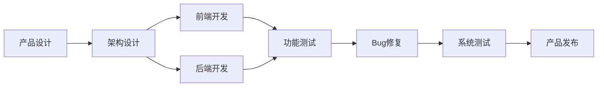
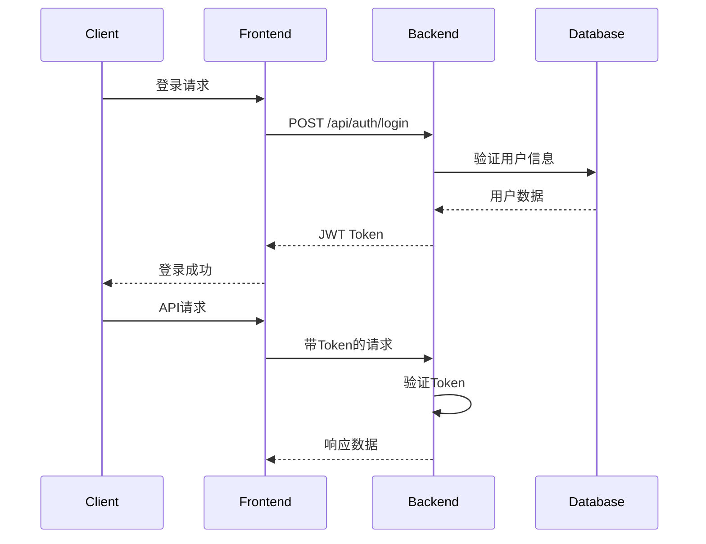
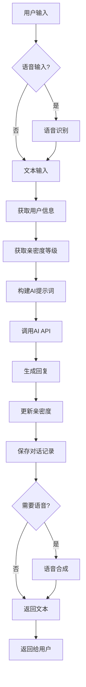

# 🏗️ AI角色对话系统 - 架构设计文档

## 📋 文档信息

- **项目名称**: AI角色对话系统 (AI Character Chat System)
- **文档版本**: v1.0
- **创建日期**: 2024年
- **最后更新**: 2024年

## 👥 团队分工

### 核心团队成员

| 姓名 | 角色 | 主要职责 |
|------|------|----------|
| **曹艺洋** | 全栈开发负责人 | • 整个项目的产品设计<br>• 前端Vue.js应用开发<br>• 后端Flask API开发<br>• 系统架构设计<br>• 全栈开发调试 |
| **刘翔宇** | 测试工程师 | • 部分Bug修复<br>• 项目完成前系统测试<br>• 功能验证和回归测试<br>• 性能测试和优化建议 |
| **薛雅琪** | 产品测试专家 | • 项目系统测试<br>• 产品设计参与<br>• 用户体验测试<br>• 测试用例设计和执行 |

### 开发流程



## 🏛️ 系统架构概览

### 整体架构图

```
┌─────────────────────────────────────────────────────────────┐
│                        用户层                                │
├─────────────────────────────────────────────────────────────┤
│  Web浏览器  │  移动端浏览器  │  管理后台  │  API客户端        │
└─────────────────────────────────────────────────────────────┘
                                │
┌─────────────────────────────────────────────────────────────┐
│                      前端层 (Vue.js)                        │
├─────────────────────────────────────────────────────────────┤
│  路由管理   │  状态管理   │  组件库   │  工具函数            │
│  (Router)   │  (Pinia)    │ (Components) │ (Utils)         │
└─────────────────────────────────────────────────────────────┘
                                │
                           HTTP/WebSocket
                                │
┌─────────────────────────────────────────────────────────────┐
│                      后端层 (Flask)                         │
├─────────────────────────────────────────────────────────────┤
│  路由层     │  服务层     │  数据层   │  外部服务            │
│  (Routes)   │ (Services)  │ (Data)    │ (External APIs)     │
└─────────────────────────────────────────────────────────────┘
                                │
┌─────────────────────────────────────────────────────────────┐
│                      数据存储层                              │
├─────────────────────────────────────────────────────────────┤
│  JSON文件   │  日志文件   │  静态资源  │  配置文件           │
│  (Data)     │ (Logs)      │ (Assets)   │ (Config)           │
└─────────────────────────────────────────────────────────────┘
```

## 📦 模块规格说明

### 1. 前端模块 (Frontend Modules)

#### 1.1 核心框架模块
- **技术栈**: Vue.js 3 + Vue Router + Axios
- **构建工具**: Vite
- **样式方案**: CSS3 + 响应式设计

#### 1.2 页面模块 (Views)

| 模块名称 | 文件路径 | 功能描述 | 依赖组件 |
|----------|----------|----------|----------|
| **首页** | `src/views/HomePage.vue` | 系统入口，角色展示 | CharacterCard |
| **登录页** | `src/views/LoginPage.vue` | 用户登录注册 | - |
| **角色列表** | `src/views/CharacterList.vue` | 角色选择界面 | CharacterCard |
| **聊天页面** | `src/views/ChatPage.vue` | 核心对话界面 | MessageBubble, IntimacyBar |
| **设置页面** | `src/views/SettingsPage.vue` | 用户设置管理 | PersonalInfoModal |
| **管理后台** | `src/views/AdminDashboard.vue` | 系统管理界面 | Admin组件群 |

#### 1.3 组件模块 (Components)

##### 通用组件
| 组件名称 | 文件路径 | 功能描述 | Props | Events |
|----------|----------|----------|-------|--------|
| **角色卡片** | `CharacterCard.vue` | 角色信息展示 | `character` | `@select` |
| **消息气泡** | `MessageBubble.vue` | 对话消息显示 | `message, isUser` | - |
| **亲密度条** | `IntimacyBar.vue` | 亲密度可视化 | `level, progress` | - |

##### 管理组件
| 组件名称 | 文件路径 | 功能描述 | 权限要求 |
|----------|----------|----------|----------|
| **用户管理** | `admin/AdminUsers.vue` | 用户CRUD操作 | 管理员 |
| **角色管理** | `admin/AdminCharacters.vue` | 角色配置管理 | 管理员 |
| **数据统计** | `admin/AdminStatistics.vue` | 系统数据展示 | 管理员 |

#### 1.4 工具模块 (Utils)

| 模块名称 | 文件路径 | 功能描述 |
|----------|----------|----------|
| **音频转换** | `utils/audioConverter.js` | 音频格式转换 |
| **音频工具** | `utils/audioUtils.js` | 音频处理工具 |
| **API服务** | `apiService.js` | HTTP请求封装 |
| **认证管理** | `composables/useAuth.js` | 用户认证逻辑 |

### 2. 后端模块 (Backend Modules)

#### 2.1 路由模块 (Routes)

| 路由模块 | 文件路径 | 功能描述 | 端点前缀 |
|----------|----------|----------|----------|
| **AI路由** | `routes/ai_routes.py` | AI对话接口 | `/api/ai` |
| **认证路由** | `routes/auth_routes.py` | 用户认证 | `/api/auth` |
| **管理路由** | `routes/admin_routes.py` | 管理功能 | `/api/admin` |
| **角色路由** | `routes/character_routes.py` | 角色管理 | `/api/character` |
| **亲密度路由** | `routes/intimacy_routes.py` | 亲密度系统 | `/api/intimacy` |
| **语音路由** | `routes/asr_routes.py` | 语音识别 | `/api/asr` |
| **TTS路由** | `routes/tts_routes.py` | 语音合成 | `/api/tts` |

#### 2.2 服务模块 (Services)

| 服务模块 | 文件路径 | 功能描述 | 主要方法 |
|----------|----------|----------|----------|
| **AI服务** | `services/ai_service.py` | 智能对话生成 | `character_chat_with_intimacy()` |
| **用户服务** | `services/user_service.py` | 用户管理 | `register_user()`, `login_user()` |
| **会话服务** | `services/session_service.py` | 对话上下文 | `create_session()`, `get_context()` |
| **亲密度服务** | `services/intimacy_service.py` | 亲密度计算 | `get_intimacy()`, `increase_intimacy()` |
| **语音服务** | `services/asr_service.py` | 语音识别 | `recognize_audio()` |
| **TTS服务** | `services/tts_service.py` | 语音合成 | `synthesize_speech()` |
| **日志服务** | `services/log_service.py` | 系统日志 | `log()`, `get_logs()` |

#### 2.3 数据模块 (Data Models)

| 数据模型 | 存储文件 | 数据结构 | 主要字段 |
|----------|----------|----------|----------|
| **用户模型** | `data/users.json` | JSON对象 | `id, username, password, email, avatar` |
| **角色模型** | `data/character_configs.json` | JSON对象 | `id, name, description, prompt, avatar` |
| **会话模型** | `data/sessions.json` | JSON对象 | `id, user_id, character_id, messages` |
| **统计模型** | `data/stats.json` | JSON对象 | `total_users, total_messages, daily_stats` |

## 🔌 接口文档 (API Documentation)

### 认证接口 (Authentication APIs)

#### POST /api/auth/register
**用户注册**

```http
POST /api/auth/register
Content-Type: application/json

{
  "username": "string",
  "password": "string", 
  "email": "string",
  "nickname": "string"
}
```

**响应示例**:
```json
{
  "success": true,
  "message": "注册成功",
  "user": {
    "id": "uuid",
    "username": "string",
    "nickname": "string",
    "avatar": "base64_image_data"
  }
}
```

#### POST /api/auth/login
**用户登录**

```http
POST /api/auth/login
Content-Type: application/json

{
  "username": "string",
  "password": "string"
}
```

**响应示例**:
```json
{
  "success": true,
  "token": "jwt_token",
  "user": {
    "id": "uuid",
    "username": "string",
    "nickname": "string",
    "is_admin": false
  }
}
```

### AI对话接口 (AI Chat APIs)

#### POST /api/character_chat
**角色对话**

```http
POST /api/character_chat
Content-Type: application/json
Authorization: Bearer {token}

{
  "character_id": "string",
  "user_query": "string",
  "session_id": "string",
  "model": "string",
  "stream": false
}
```

**响应示例**:
```json
{
  "success": true,
  "response": "AI回复内容",
  "session_id": "string",
  "intimacy_info": {
    "level": 5,
    "name": "聊得火热",
    "progress": 0.6
  }
}
```

### 角色管理接口 (Character APIs)

#### GET /api/character_config
**获取所有角色配置**

```http
GET /api/character_config
```

**响应示例**:
```json
{
  "success": true,
  "characters": [
    {
      "id": "confucius",
      "name": "孔子",
      "description": "古代思想家、教育家",
      "tags": ["哲学", "教育", "历史"],
      "avatar": "/avatars/confucius.png"
    }
  ]
}
```

#### GET /api/character_config/{character_id}
**获取特定角色配置**

```http
GET /api/character_config/confucius
```

### 语音接口 (Voice APIs)

#### POST /api/voice_recognition
**语音识别**

```http
POST /api/voice_recognition
Content-Type: multipart/form-data

{
  "audio": "audio_file"
}
```

**响应示例**:
```json
{
  "success": true,
  "text": "识别出的文字内容",
  "confidence": 0.95
}
```

#### POST /api/tts
**语音合成**

```http
POST /api/tts
Content-Type: application/json

{
  "text": "要合成的文字",
  "character_id": "confucius",
  "voice_params": {
    "rate": 160,
    "volume": 0.8
  }
}
```

### 管理接口 (Admin APIs)

#### GET /api/admin/statistics
**获取系统统计**

```http
GET /api/admin/statistics
Authorization: Bearer {admin_token}
```

**响应示例**:
```json
{
  "success": true,
  "data": {
    "totalUsers": 150,
    "totalMessages": 5280,
    "totalCharacters": 24,
    "todayMessages": 89,
    "popularCharacters": [
      {
        "id": "confucius",
        "name": "孔子",
        "totalIntimacy": 1250,
        "userCount": 45
      }
    ]
  }
}
```

#### GET /api/admin/users
**获取用户列表**

```http
GET /api/admin/users
Authorization: Bearer {admin_token}
```

#### POST /api/admin/users
**创建用户**

```http
POST /api/admin/users
Authorization: Bearer {admin_token}
Content-Type: application/json

{
  "username": "string",
  "password": "string",
  "email": "string",
  "nickname": "string",
  "is_admin": false
}
```

### 亲密度接口 (Intimacy APIs)

#### GET /api/intimacy/{user_id}/{character_id}
**获取亲密度信息**

```http
GET /api/intimacy/user123/confucius
Authorization: Bearer {token}
```

**响应示例**:
```json
{
  "success": true,
  "intimacy": {
    "level": 5,
    "name": "聊得火热",
    "progress": 0.6,
    "total_messages": 23
  }
}
```

## 🔐 安全架构

### 认证授权机制



### 权限控制矩阵

| 功能模块 | 游客 | 普通用户 | 管理员 |
|----------|------|----------|--------|
| 角色对话 | ✅ | ✅ | ✅ |
| 亲密度累积 | ❌ | ✅ | ✅ |
| 对话历史 | ❌ | ✅ | ✅ |
| 用户管理 | ❌ | ❌ | ✅ |
| 角色管理 | ❌ | ❌ | ✅ |
| 系统统计 | ❌ | ❌ | ✅ |

## 📊 数据流架构

### 对话流程图



### 数据存储架构

```
data/
├── users.json              # 用户数据
│   ├── user_id
│   │   ├── username
│   │   ├── password_hash
│   │   ├── email
│   │   ├── nickname
│   │   ├── avatar
│   │   ├── is_admin
│   │   └── intimacy{}       # 与各角色的亲密度
├── character_configs.json   # 角色配置
│   ├── character_id
│   │   ├── name
│   │   ├── description
│   │   ├── tags[]
│   │   ├── avatar
│   │   ├── prompt
│   │   └── voice_params{}
├── sessions.json           # 会话数据
│   ├── session_id
│   │   ├── user_id
│   │   ├── character_id
│   │   ├── created_at
│   │   └── messages[]
└── stats.json             # 统计数据
    ├── total_users
    ├── total_messages
    ├── daily_stats{}
    └── character_stats{}
```

## 🧪 测试架构

### 测试策略

| 测试类型 | 负责人 | 测试工具 | 覆盖范围 |
|----------|--------|----------|----------|
| **单元测试** | 曹艺洋 | Jest, Pytest | 核心业务逻辑 |
| **集成测试** | 刘翔宇 | Postman, Pytest | API接口测试 |
| **系统测试** | 薛雅琪 | 手工测试 | 端到端功能 |
| **性能测试** | 刘翔宇 | JMeter | 并发和负载 |
| **用户体验测试** | 薛雅琪 | 用户反馈 | 界面和交互 |

### 测试用例结构

```
tests/
├── backend/                 # 后端测试
│   ├── test_auth.py        # 认证测试
│   ├── test_ai_service.py  # AI服务测试
│   ├── test_intimacy.py    # 亲密度测试
│   └── test_api.py         # API接口测试
├── frontend/               # 前端测试
│   ├── unit/              # 单元测试
│   ├── integration/       # 集成测试
│   └── e2e/              # 端到端测试
└── performance/           # 性能测试
    ├── load_test.py       # 负载测试
    └── stress_test.py     # 压力测试
```

## 🚀 部署架构

### 开发环境

```yaml
Development Environment:
  Frontend:
    - Node.js 16+
    - Vite Dev Server (Port: 5173)
    - Hot Module Replacement
  
  Backend:
    - Python 3.8+
    - Flask Dev Server (Port: 5000)
    - Auto-reload enabled
  
  Database:
    - JSON Files
    - Local File System
```

### 生产环境

```yaml
Production Environment:
  Frontend:
    - Static Files (Nginx)
    - CDN Distribution
    - Gzip Compression
  
  Backend:
    - Gunicorn WSGI Server
    - Nginx Reverse Proxy
    - SSL/TLS Encryption
  
  Database:
    - JSON Files with Backup
    - Log Rotation
    - Monitoring
```

## 📈 性能规格

### 系统性能指标

| 指标 | 目标值 | 测试方法 |
|------|--------|----------|
| **响应时间** | < 2秒 | API接口测试 |
| **并发用户** | 100+ | 负载测试 |
| **可用性** | 99.9% | 系统监控 |
| **错误率** | < 0.1% | 错误日志分析 |

### 资源使用规格

| 资源 | 最小配置 | 推荐配置 |
|------|----------|----------|
| **CPU** | 2核 | 4核 |
| **内存** | 4GB | 8GB |
| **存储** | 10GB | 50GB |
| **带宽** | 10Mbps | 100Mbps |

## 🔧 配置管理

### 环境配置

```python
# config.py
class Config:
    # 七牛云AI API配置
    QINIU_AI_API_KEY = os.getenv('QINIU_AI_API_KEY')
    QINIU_AI_BASE_URL = os.getenv('QINIU_AI_BASE_URL')
    
    # Flask配置
    FLASK_ENV = os.getenv('FLASK_ENV', 'development')
    FLASK_RUN_PORT = int(os.getenv('FLASK_RUN_PORT', 5000))
    
    # 默认模型配置
    DEFAULT_MODEL = 'x-ai/grok-4-fast'
```

### 角色配置模板

```json
{
  "character_id": {
    "name": "角色名称",
    "description": "角色描述",
    "tags": ["标签1", "标签2"],
    "avatar": "/avatars/character.png",
    "prompt": "角色对话风格提示词",
    "voice_params": {
      "engine": "qiniu_tts",
      "voice_id": "voice_type",
      "rate": 160,
      "volume": 0.8,
      "language": "zh"
    },
    "language_style": "formal"
  }
}
```

## 📝 开发规范

### 代码规范

#### 前端规范
- **命名规范**: PascalCase (组件), camelCase (变量/方法)
- **文件结构**: 按功能模块组织
- **组件规范**: 单文件组件 (.vue)
- **样式规范**: CSS模块化，响应式设计

#### 后端规范
- **命名规范**: snake_case
- **文档规范**: Docstring注释
- **错误处理**: 统一异常处理机制
- **日志规范**: 结构化日志记录

### Git工作流

```mermaid
gitgraph
    commit id: "初始化项目"
    branch feature/frontend
    checkout feature/frontend
    commit id: "前端基础框架"
    commit id: "用户界面开发"
    checkout main
    merge feature/frontend
    branch feature/backend
    checkout feature/backend
    commit id: "后端API开发"
    commit id: "AI服务集成"
    checkout main
    merge feature/backend
    branch bugfix/issues
    checkout bugfix/issues
    commit id: "Bug修复"
    checkout main
    merge bugfix/issues
    commit id: "版本发布"
```

## 📚 技术债务管理

### 已知技术债务

1. **数据存储**: 当前使用JSON文件，需要考虑迁移到数据库
2. **缓存机制**: 缺少Redis等缓存层
3. **监控系统**: 需要完善的系统监控和告警
4. **自动化测试**: 测试覆盖率需要提升
5. **文档完善**: API文档需要自动化生成

### 优化计划

| 优先级 | 技术债务 | 预计工作量 | 负责人 |
|--------|----------|------------|--------|
| 高 | 数据库迁移 | 2周 | 曹艺洋 |
| 中 | 缓存系统 | 1周 | 曹艺洋 |
| 中 | 监控告警 | 1周 | 刘翔宇 |
| 低 | 测试覆盖 | 2周 | 薛雅琪 |

---

## 📞 联系方式

如有架构相关问题，请联系：

- **技术负责人**: 曹艺洋
- **测试负责人**: 刘翔宇, 薛雅琪
- **项目邮箱**: [project-email@example.com]

---

*本文档将随着项目发展持续更新维护*
